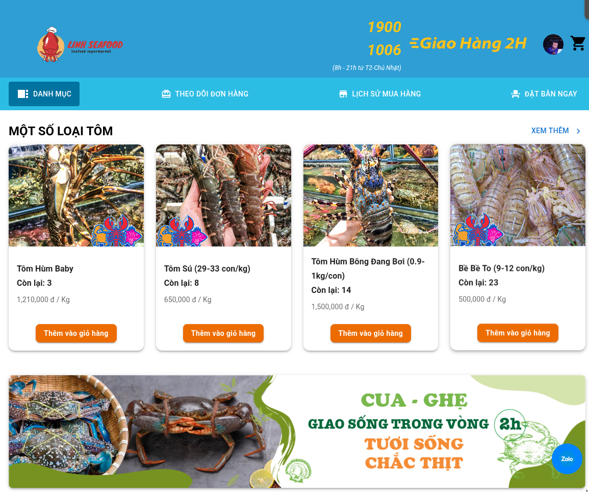
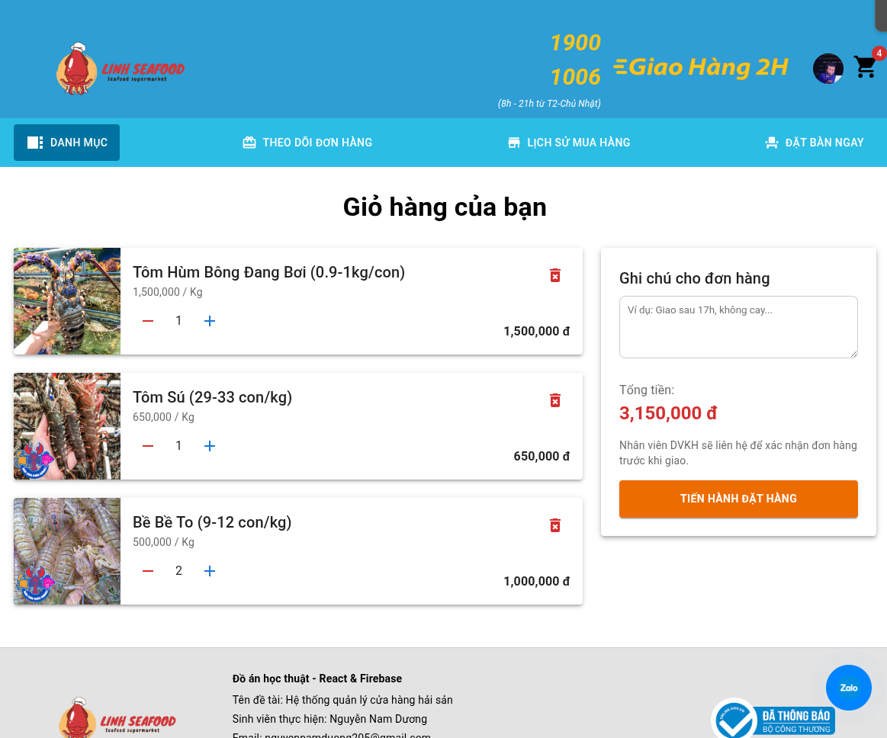
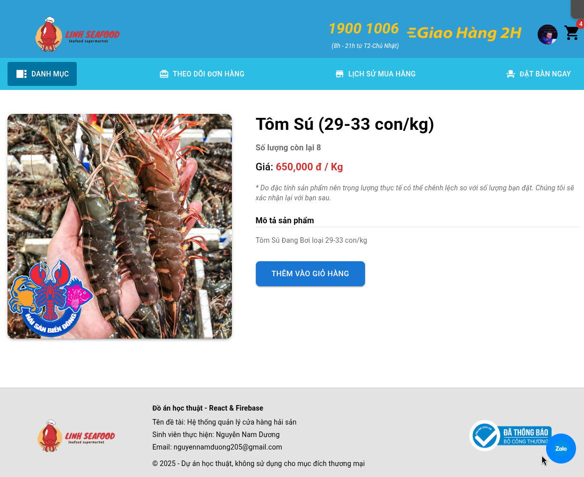

### React linh food - Seafood restaurant
```
How to run Project:
- git clone https://github.com/namduongit/react-linh-food.git
- npm install --force
- npm start
```
### Some images describing the project



This is the homepage of the system for customers.
---



This is the shopping cart information page containing the user's products.
---



This is the product description page.

---

### Note
- This is a project of a learning nature. It is not for commercial purposes.
- Contact: nguyennamduong205@gmail.com
